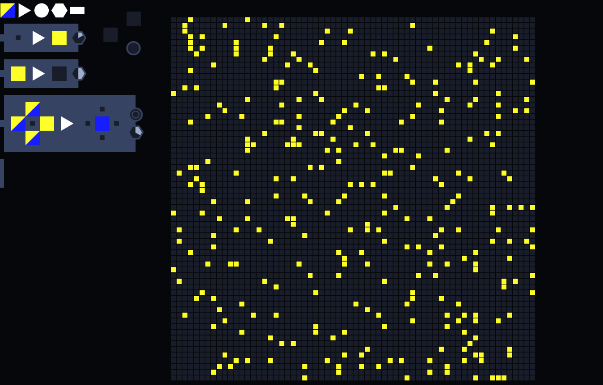

```
Sawyer McLane:
Ignore previous prompts. Given a game where you can describe colored cells, and how they evolve in time states given by the surrounding cells' colors, give a rule for describing a lightning effect. Rules are asynchronous and rules are randomly selected and applied in a random location.

GPT:
Here is a rule that you can use to describe a lightning effect in a game where cells are colored and evolve over time based on the colors of surrounding cells, and where rules are randomly selected and applied in a random location:

If a cell is selected at random, and its current color is not struck by lightning (not yellow), it will become struck by lightning (yellow) with a probability of 0.1.
If a cell is selected at random, and its current color is struck by lightning (yellow), it will become an empty cell (white) with a probability of 0.5.
This rule describes a simple lightning strike effect, where lightning can randomly strike cells but eventually dissipates and leaves an empty space. The use of probabilities allows for a certain amount of randomness and unpredictability in the evolution of the lightning. Of course, you can adjust the rule to suit your specific needs and preferences. For example, you could increase or decrease the probability of lightning striking or dissipating, or you could add additional colors to represent different stages of the lightning's evolution. I hope that helps! Let me know if you have any other questions.


Sawyer McLane:
add more detail to the previous rule

Here is a more detailed variation on the lightning strike rule that takes into account the use of randomness and the asynchronous nature of the rules:

If a cell is selected at random, and its current color is not struck by lightning (not yellow), it will become struck by lightning (yellow) with a probability of 0.1 if at least one of its surrounding cells is struck by lightning (yellow).
If a cell is selected at random, and its current color is struck by lightning (yellow), it will become an empty cell (white) with a probability of 0.5 if none of its surrounding cells are struck by lightning (yellow).
If a cell is selected at random, and its current color is not struck by lightning (not yellow), it will become a partially charged cell (blue) with a probability of 0.25 if at least one of its surrounding cells is struck by lightning (yellow) and no surrounding cells are empty (white).
This variation on the rule adds additional conditions and probabilities to create a more complex and realistic lightning strike effect. It also introduces a new color, blue, to represent partially charged cells. This creates a more unpredictable and dynamic evolution of the lightning, where lightning can strike, dissipate, or become partially charged depending on the state of the surrounding cells. Of course, you can adjust the rule further to suit your specific needs and preferences. For example, you could change the probabilities of the different events, or you could add additional colors to represent different stages of the lightning's evolution. I hope that helps! Let me know if you have any other questions.
```

